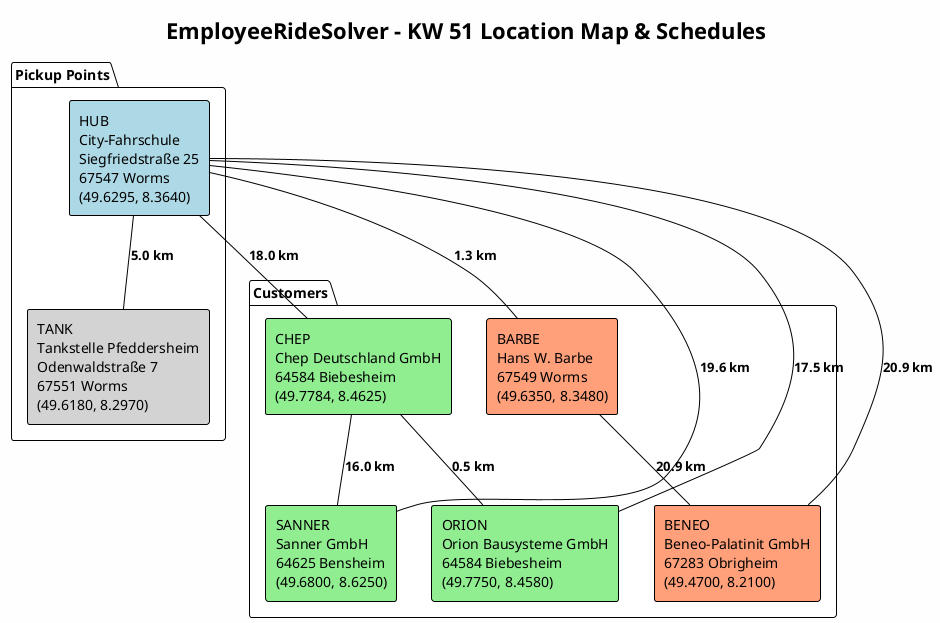
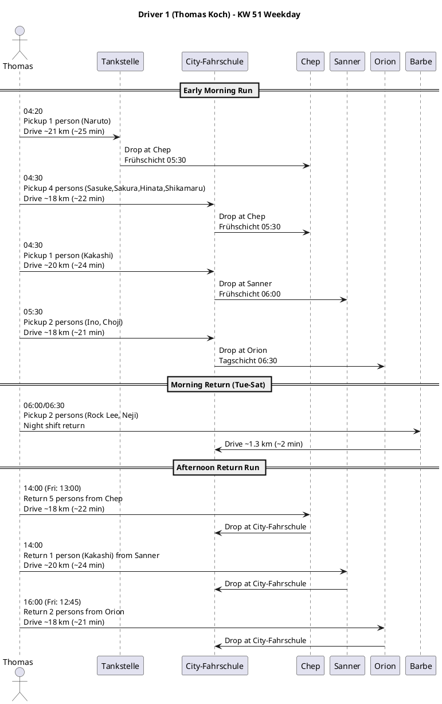
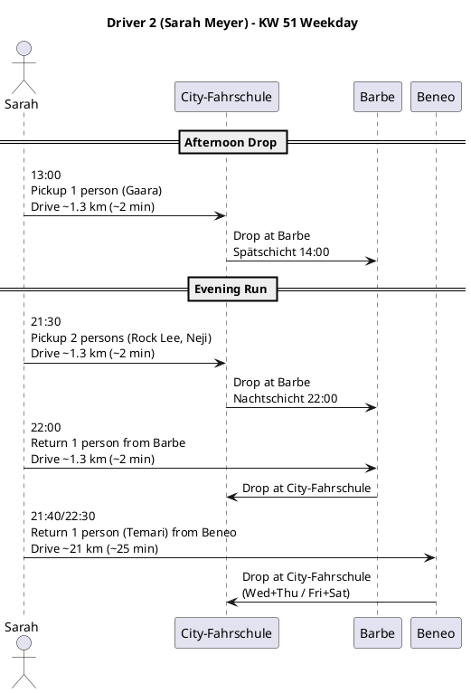
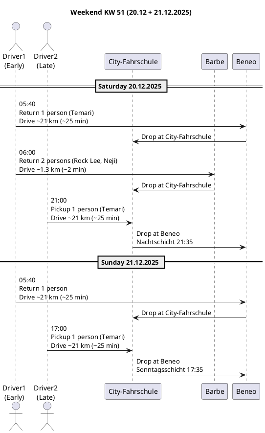
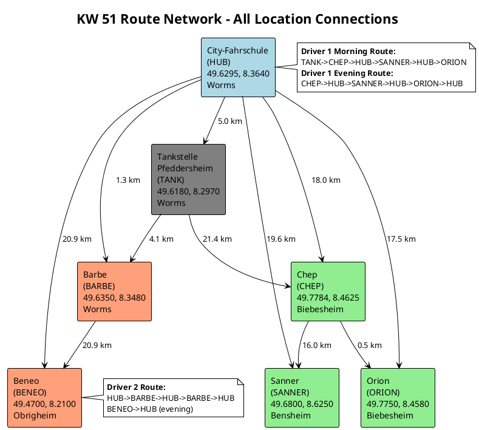

# EmployeeRideSolver - KW 51 Visualization Data

## 1. Location Coordinates (from DataBootstrap.java)

### Hub / Pickup Points

| ID | Name | Address | Latitude | Longitude |
|----|------|---------|----------|-----------|
| HUB | City-Fahrschule | Siegfriedstraße 25, 67547 Worms | 49.6295 | 8.3640 |
| TANK | Tankstelle Pfeddersheim | Odenwaldstraße 7, 67551 Worms | 49.6180 | 8.2970 |

### Customer Locations

| ID | Name | Address | Latitude | Longitude |
|----|------|---------|----------|-----------|
| CHEP | Chep Deutschland GmbH | Am Winkelgraben 13, 64584 Biebesheim | 49.7784 | 8.4625 |
| SANNER | Sanner GmbH | Bertha-Benz-Straße 5, 64625 Bensheim | 49.6800 | 8.6250 |
| ORION | Orion Bausysteme GmbH | Waldstr. 2, 64584 Biebesheim | 49.7750 | 8.4580 |
| BARBE | Hans W. Barbe Chemische Erzeugnisse GmbH | Justus-von-Liebig-Str. 17, 67549 Worms | 49.6350 | 8.3480 |
| BENEO | Beneo-Palatinit GmbH | Wormser Straße 11, 67283 Obrigheim | 49.4700 | 8.2100 |

### Employee Pickup Assignments

| Employee | Type | Pickup Location |
|----------|------|-----------------|
| Naruto Uzumaki | Site (Chep) | TANK (Pfeddersheim) |
| Sasuke Uchiha | Site (Chep) | HUB |
| Sakura Haruno | Site (Chep) | HUB |
| Hinata Hyuga | Site (Chep) | HUB |
| Shikamaru Nara | Site (Chep) | HUB |
| Kakashi Hatake | Site (Sanner) | HUB |
| Ino Yamanaka | Site (Orion) | HUB |
| Choji Akimichi | Site (Orion) | HUB |
| Rock Lee | Site (Barbe) | HUB |
| Neji Hyuga | Site (Barbe) | HUB |
| Gaara Sabaku | Site (Barbe) | HUB |
| Temari Sabaku | Site (Beneo) | HUB |

### Drivers (home = HUB)

| Name | Email | Phone |
|------|-------|-------|
| Thomas Koch | thomas@example.com | +49 151 1234 5607 |
| Sarah Meyer | sarah@example.com | +49 151 1234 5608 |
| Michael Wagner | michael@example.com | +49 151 1234 5609 |

---

## 2. Haversine Distance Matrix (meters)

| From\To | HUB | TANK | CHEP | SANNER | ORION | BARBE | BENEO |
|---------|-----|------|------|--------|-------|-------|-------|
| HUB | 0 | 4,993 | 18,009 | 19,610 | 17,534 | 1,305 | 20,928 |
| TANK | 4,993 | 0 | 21,443 | 24,600 | 20,949 | 4,131 | 17,613 |
| CHEP | 18,009 | 21,443 | 0 | 16,004 | 497 | 17,946 | 38,817 |
| SANNER | 19,610 | 24,600 | 16,004 | 0 | 15,990 | 20,557 | 37,956 |
| ORION | 17,534 | 20,949 | 497 | 15,990 | 0 | 17,462 | 38,332 |
| BARBE | 1,305 | 4,131 | 17,946 | 20,557 | 17,462 | 0 | 20,874 |
| BENEO | 20,928 | 17,613 | 38,817 | 37,956 | 38,332 | 20,874 | 0 |

### Key Distances Summary (Haversine / Road Estimate at 1.35x / Drive Time at 50km/h avg)

| Pair | Haversine | Road Est | Drive Time |
|------|-----------|----------|------------|
| HUB - BARBE | 1.3 km | 1.8 km | ~2 min |
| HUB - TANK | 5.0 km | 6.7 km | ~8 min |
| HUB - ORION | 17.5 km | 23.7 km | ~28 min |
| HUB - CHEP | 18.0 km | 24.3 km | ~29 min |
| HUB - SANNER | 19.6 km | 26.5 km | ~32 min |
| HUB - BENEO | 20.9 km | 28.2 km | ~34 min |
| CHEP - ORION | 0.5 km | 0.7 km | ~1 min |
| CHEP - SANNER | 16.0 km | 21.6 km | ~26 min |
| BARBE - TANK | 4.1 km | 5.6 km | ~7 min |
| BARBE - BENEO | 20.9 km | 28.2 km | ~34 min |

---

## 3. Manual Plan KW 51 - Driver Schedules (from manual-plan.md)

### Driver 1 (Thomas Koch) - Weekday Schedule

| Time | Action | From | To | Passengers | Notes |
|------|--------|------|----|------------|-------|
| 04:20 | Pickup -> Drop | Tankstelle Pfeddersheim | Chep | 1 (Naruto) | Frühschicht 05:30 |
| 04:30 | Pickup -> Drop | City-Fahrschule | Chep | 4 (Sasuke, Sakura, Hinata, Shikamaru) | Frühschicht 05:30 |
| 04:30 | Pickup -> Drop | City-Fahrschule | Sanner | 1 (Kakashi) | Frühschicht 06:00 |
| 05:30 | Pickup -> Drop | City-Fahrschule | Orion | 2 (Ino, Choji) | Tagschicht 06:30 |
| 06:00/06:30 | Pickup -> Drop | Barbe | City-Fahrschule | 2 (Rock Lee, Neji) | Night shift return, Tue-Sat mornings |
| 14:00 | Pickup -> Drop | Chep | City-Fahrschule | 5 (all Chep) | Fri: 13:00 |
| 14:00 | Pickup -> Drop | Sanner | City-Fahrschule | 1 (Kakashi) | |
| 16:00 | Pickup -> Drop | Orion | City-Fahrschule | 2 (Ino, Choji) | Fri: 12:45 combined with Chep |

### Driver 2 (Sarah Meyer) - Weekday Schedule

| Time | Action | From | To | Passengers | Notes |
|------|--------|------|----|------------|-------|
| 13:00 | Pickup -> Drop | City-Fahrschule | Barbe | 1 (Gaara) | Spätschicht 14:00 |
| 21:30 | Pickup -> Drop | City-Fahrschule | Barbe | 2 (Rock Lee, Neji) | Nachtschicht 22:00 |
| 22:00 | Pickup -> Drop | Barbe | City-Fahrschule | 1 | Return from late shift |
| 21:40/22:30 | Pickup -> Drop | Beneo | City-Fahrschule | 1 (Temari) | Night shift return; Wed+Thu / Fri+Sat |

### Weekend Schedule (Sat 20.12 + Sun 21.12.2025)

**Driver 1 (Early shift):**

| Time | Day | Action | From | To | Passengers | Notes |
|------|-----|--------|------|----|------------|-------|
| 05:40 | Sat+Sun | Pickup -> Drop | Beneo | City-Fahrschule | 1 (Temari) | Night shift return |
| 06:00 | Sat only | Pickup -> Drop | Barbe | City-Fahrschule | 2 (Rock Lee, Neji) | Night shift return |

**Driver 2 (Late shift):**

| Time | Day | Action | From | To | Passengers | Notes |
|------|-----|--------|------|----|------------|-------|
| 21:00 | Sat | Pickup -> Drop | City-Fahrschule | Beneo | 1 (Temari) | Nachtschicht 21:35 |
| 17:00 | Sun | Pickup -> Drop | City-Fahrschule | Beneo | 1 (Temari) | Sonntagsschicht 17:35 |

---

## 4. PlantUML Diagram Data

### 4a. Location Map Diagram

### 4b. Driver 1 Weekday Sequence

### 4c. Driver 2 Weekday Sequence

### 4d. Weekend Schedule Sequence

### 4e. Full Route Network Activity Diagram

